

<h1 align="center">Prototype Portfolio RPG</h1>
<h4>Designed and developed by: Lemuel Nogueira</h4>

  
Table of Contents

  <ol>
    <li><a href="#about-the-project">About the Project</a></li>
    <li><a href="#features">Features</a></li>
    <li><a href="#controls">Controls</a></li>
    <li><a href="#how-to-play">How to Play</a></li>
    <li><a href="#roadmap">Roadmap</a></li>
    <li><a href="#contact">Contact</a></li>
  </ol>

## About the Project

This project is a 2D monster-taming, turn-based RPG built in Unity. You control a party of battlers led by a "Commander," a unique battler who inspires and leads others into battle. Rival Commanders and other NPCs that populate the world can be engaged with in battle, traded with, and more. The battle system includes multiple actions such as attacking, guarding, talking to recruit other battlers, using items, and more. The focus of this prototype is on developing and refining the core gameplay mechanics to achieve engaging and intuitive interactions. After these foundational systems are fully implemented and refined, future iterations will concentrate on world-building, narrative development, and visual design.

(<a href="#readme-top">back to top</a>)

## Features

- **Main Menu**  
  Provides options to continue from your last save, begin a new game, or quit.

  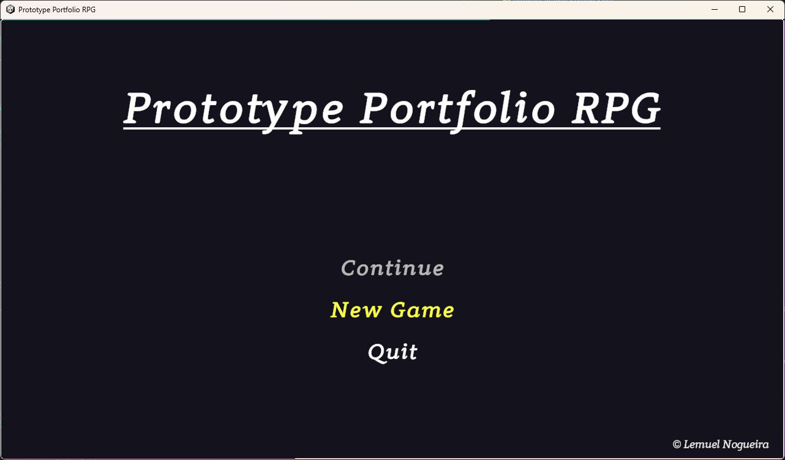

- **Character Selection**  
  Lets you pick a Commander from a set of predefined characters, each with assigned types and stats. This chosen character remains central to your party throughout the game.

  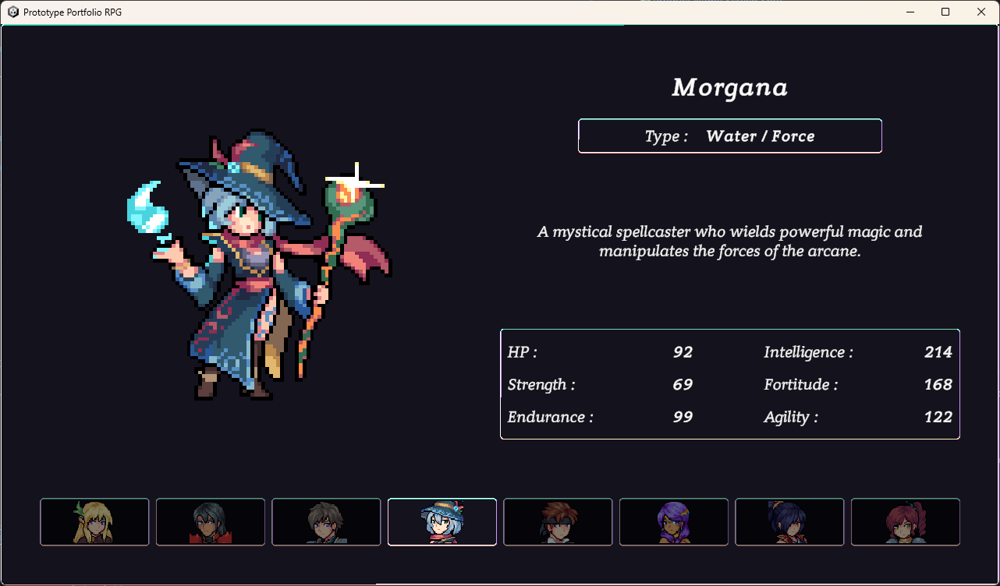

  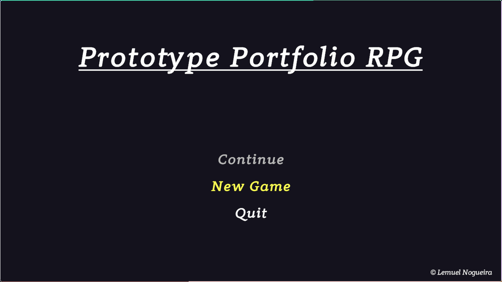

- **World Exploration and Interaction**  
  Gives you the ability to move freely in a 2D environment and interact with NPCs, merchants, innkeepers, quest givers, and more. You can open the in-game menu to view your party, inventory, and barracks, or to save/load the game.

  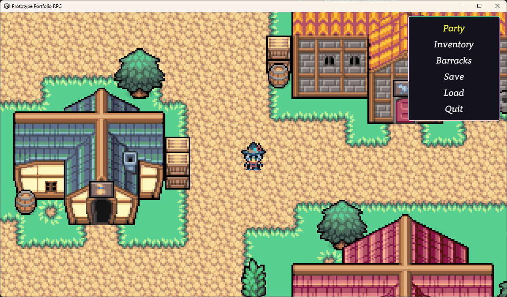

  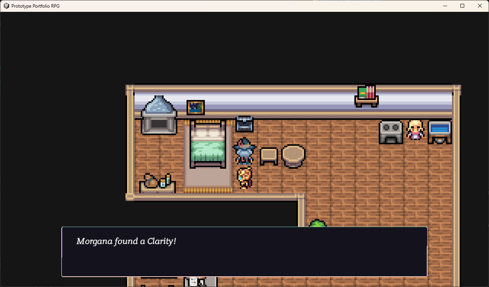

  

  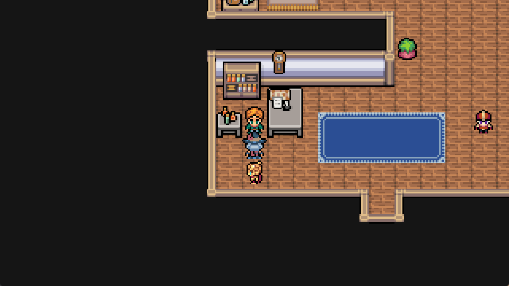

- **Party Management**  
  Supports a maximum of six battlers (one Commander and up to five others). You can reorder the party and view detailed summaries of each member.

  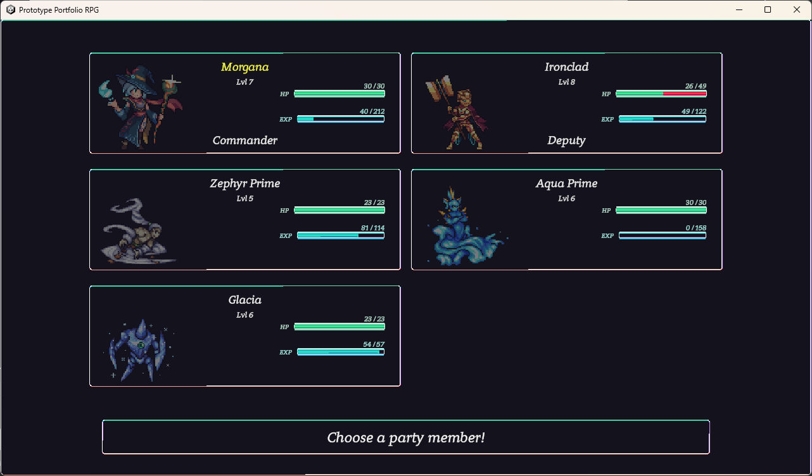

  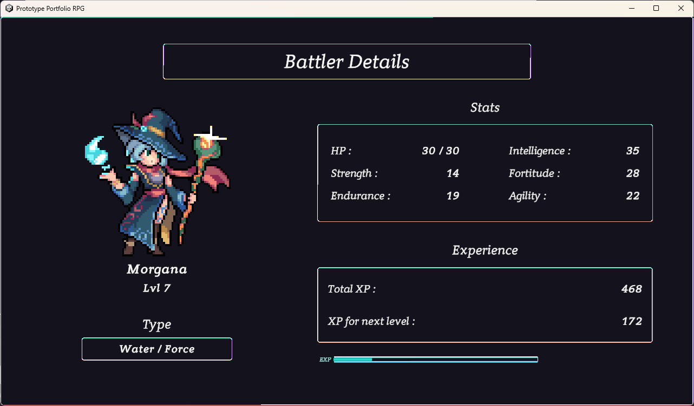

- **Deputy Mechanic**  
  Designates the second battler (or the first if the Commander has been moved from the first slot) as the deputy who follows the Commander around. Future plans include giving the deputy unique abilities to influence exploration and battles.

- **Inventory System**  
  Organizes items by category and shows your GP (in-game currency). You can use specific items from this screen.

- **Barracks Organization**  
  Provides a storage area for extra battlers, split into depots for organizational purposes. You can move battlers between your party and these depots, but the Commander must remain in the party.

  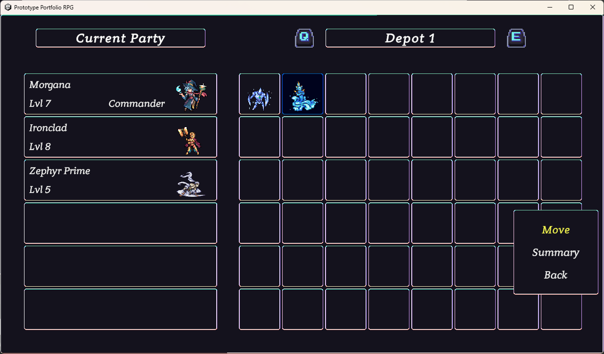

- **Battle System**  
  Utilizes a turn-based combat flow with six actions:
  - **Fight:** Choose a move at the cost of SP. If SP of all moves is depleted, a weaker fallback move is used.
  - **Talk:** Available only to the Commander in rogue battles to attempt recruiting an opposing battler.
  - **Item:** Opens the inventory to use recovery items.
  - **Guard:** Temporarily reduces damage taken during the round.
  - **Switch:** Reorders party members during combat.
  - **Run:** Attempts to flee the encounter.

  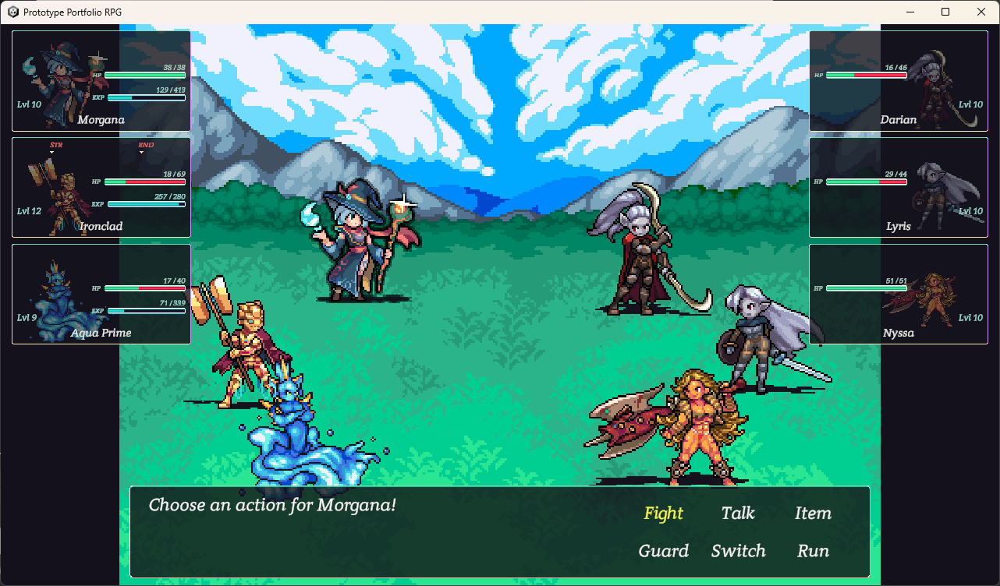

  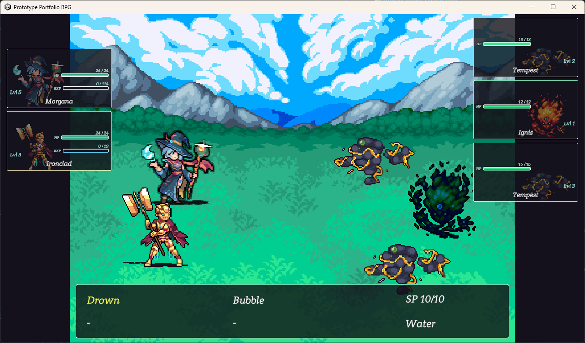
  
  

- **Battle Variants**  
  Commander Battles and Rogue Battles differ in recruitment rules and escape restrictions. In Commander Battles, you cannot recruit opposing battlers and cannot flee.

  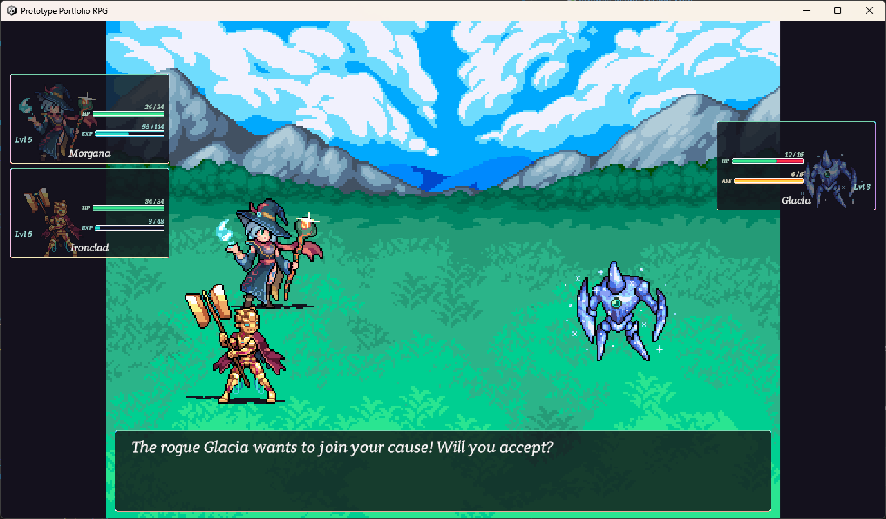

- **Experience and Leveling**  
  XP is awarded for defeating enemies. Battlers can level up, learn new moves, and transform into stronger forms.

(<a href="#readme-top">back to top</a>)

## Controls

- **Movement/Menu Navigation (Up, Down, Left, and Right Arrow keys):**  
  Use the up, down, left, and right arrow keys to move your character in the world and navigate menus.

- **Interaction/Selection (Z key):**  
  Use **Z** to interact with objects or NPCs, confirm actions in menus, speed up text, and progress dialogue.

- **Cancel/Back (X key):**  
  Use **X** to close menus, return to previous screens, or quickly select negative or exiting dialogue choices. Like **Z**, it can also be used to speed up text and progress dialogue.

- **In-Game Menu (Enter key):**  
  Press **Enter** to open the in-game menu while exploring.

- **Barracks Depot Navigation (Q and E keys):**  
  Use **Q** and **E** to move between depot pages in the barracks.

(<a href="#readme-top">back to top</a>)

## How to Play

1. **Download the Game**  
   - Download the game from [itch.io](https://leminiscent.itch.io/prototype-portfolio-rpg)

2. **Launch the Game**  
   - Continue from an existing save or start a new game from the main menu.

3. **Choose a Commander**  
   - Pick from the available characters, each with specific types and stats.

4. **Explore the World**  
   - Move around the demo's Village and Shop areas, interacting with NPCs and items.
   - Use the in-game menu to access the party, inventory, barracks, save/load options, and game exit.

5. **Manage Your Party**  
   - View your active battlers, reorder their positions, and check each one’s detailed stats.

6. **Inventory Usage**  
   - Check your items and see your current GP total.
   - Use applicable items directly from this menu.

7. **Barracks Maintenance**  
   - Store extra battlers in depots and transfer them to or from your active party.
   - The Commander is kept in your party, as they represent you.

8. **Engage in Battles**  
   - Encounter rival Commanders or rogue battlers during exploration.
   - Commander Battles prohibit recruitment and escaping.
   - Rogue Battles allow you to talk to potential allies for recruitment.
   - Choose from Fight, Talk (Commander only), Item, Guard, Switch, or Run actions.
   - Defeat or recruit opposing battlers to gain XP and items.

9. **Defeats and Game Over**  
   - If all your party members are defeated, the game ends and you return to the main menu.  
   - You may continue from your last save, start anew, or exit at that point.

(<a href="#readme-top">back to top</a>)

## Roadmap

- [ ] Transfer barracks functionality from the menu to a dedicated in-world facility
- [ ] Incorporate commander and deputy-specific abilities
- [ ] Add a crafting system using loot from battles
- [ ] Improve sorting features for both barracks and inventory
- [ ] Enhance dialogue visuals with camera adjustments, overhead icons, and portraits
- [ ] Expand recruitment interactions with more dialogue and scenario elements
- [ ] Introduce enemy AI that factors in current battle conditions and individual personality
- [ ] Grow the world map with new locations and interactive features

(<a href="#readme-top">back to top</a>)

## Contact

Email: [nogueiralemuel@gmail.com](mailto:nogueiralemuel@gmail.com)  
LinkedIn: [https://www.linkedin.com/in/lemuel-nogueira/](https://www.linkedin.com/in/lemuel-nogueira/)

(<a href="#readme-top">back to top</a>)

