

<h1 align="center">Prototype Portfolio RPG</h1>
<h4>Designed and developed by: Lemuel Nogueira</h4>

  
Table of Contents

  <ol>
    <li><a href="#about-the-project">About the Project</a></li>
    <li><a href="#features">Features</a></li>
    <li><a href="#controls">Controls</a></li>
    <li><a href="#how-to-play">How to Play</a></li>
    <li><a href="#roadmap">Roadmap</a></li>
    <li><a href="#contact">Contact</a></li>
  </ol>

## About the Project

This project is a 2D monster-taming and turn-based RPG built with the Unity engine. In this game, the player assembles and controls a party of creatures known as battlers, led by a special leader character called the Commander. The Commander is a unique battler who represents the player and can inspire or recruit other battlers. This prototype focuses on core RPG mechanics – exploration, party management, and combat – rather than a full narrative or extensive world. Players can explore a small demo world, engage in battles with NPC opponents, recruit new battlers, and manage their team. The goal of the project is to demonstrate and refine these foundational systems in a playable format, providing a basis for future expansion into a larger game world and story once the mechanics are polished.

(<a href="#readme-top">back to top</a>)

## Features

#### **Main Menu and Saving**

The game opens with a main menu that allows starting a new game, continuing from the last save, or quitting. A save/load system is implemented so that player progress (party composition, inventory, location, etc.) can be saved and later resumed from the Continue option.

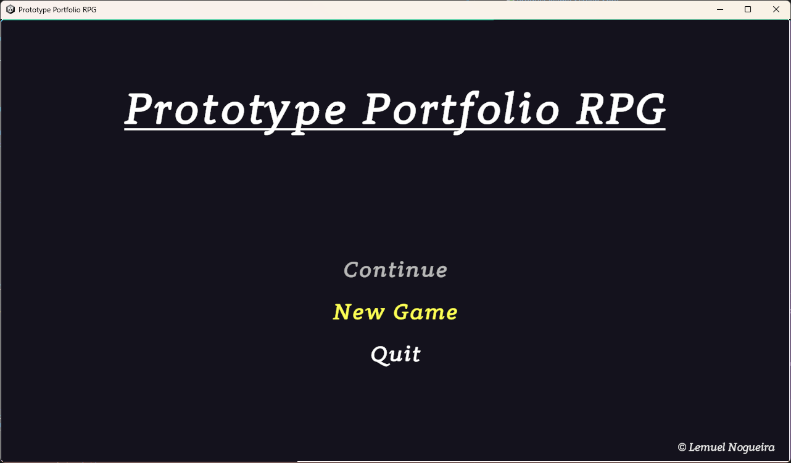

#### **Character Selection**

At the start of a new game, you choose a Commander character from a set of predefined options. Each Commander has unique starting stats and elemental types that influence their strengths and weaknesses. The selected Commander becomes the leader of your party and remains in the team throughout the adventure.

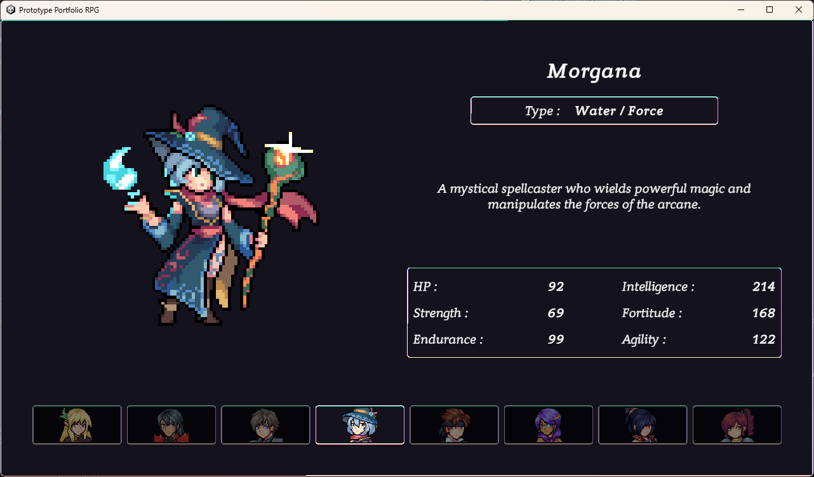

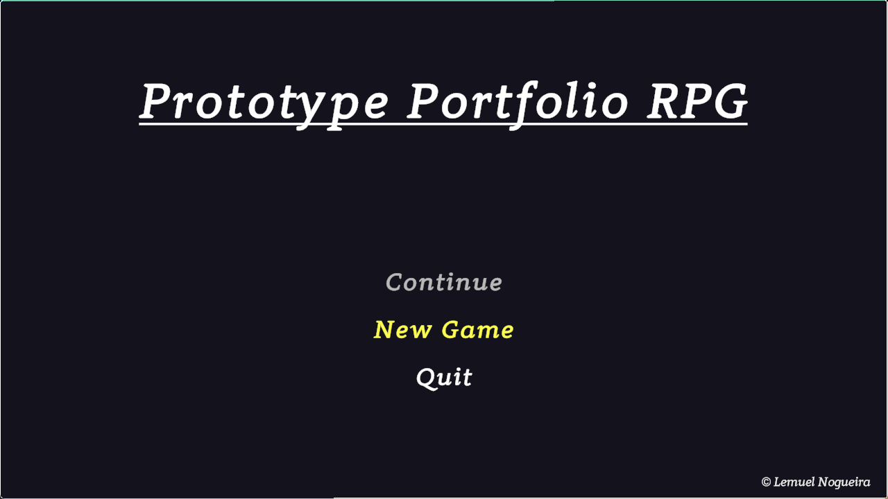

#### **Exploration and Interaction**

Once in the game world, you can freely move your character around a 2D top-down environment using the keyboard. The prototype currently includes a small village area and a shop interior as example locations. The player can explore these maps and interact with various NPCs and objects. NPCs serve multiple roles – some are friendly villagers with dialogue, while others are rival Commanders who will challenge you to battle. There are also special NPC types like merchants who will buy/sell items, innkeepers who can heal your party, and quest givers who provide simple tasks. Interacting with an NPC or object is as simple as walking up and pressing the interaction key (see Controls below). While exploring, you can press the menu key to open the in-game menu at any time. This pause menu allows checking your party’s status, viewing the inventory, managing stored battlers, or saving the game.

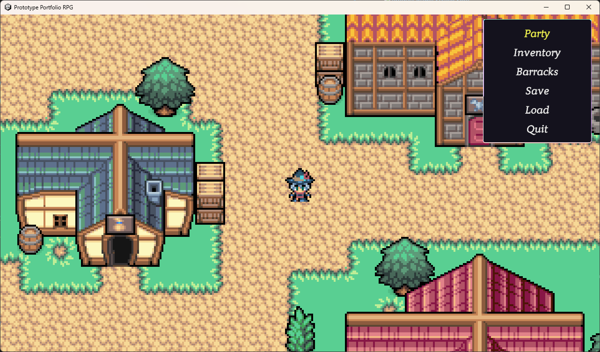

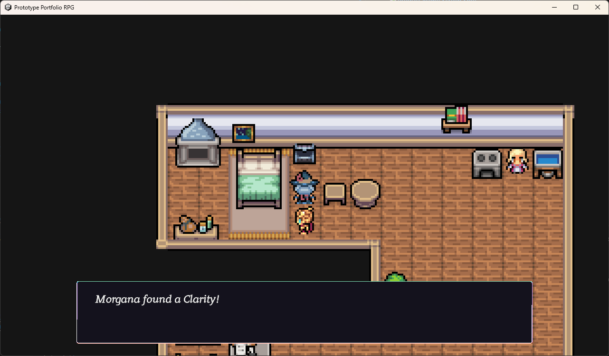

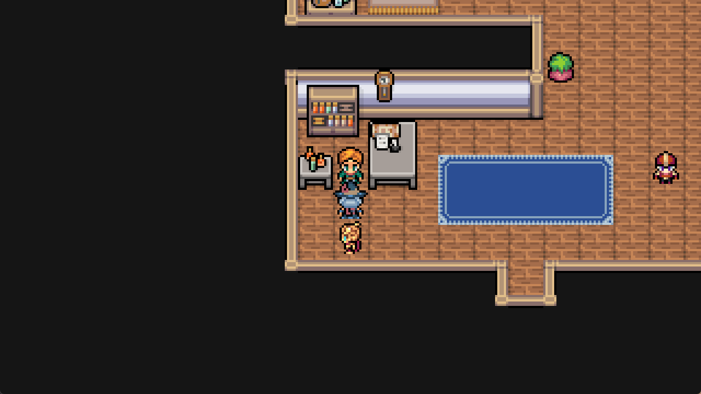

#### **Party Management and Deputy System**

The game allows a party of up to six battlers at once (a Commander plus up to five additional members). You can view detailed stats and information for each party member and reorder the lineup as needed. The UI includes a Party screen showing all active battlers and a separate Summary screen for individual battler details (stats, moves, experience, etc.). A special mechanic is the Deputy: the battler in the first party slot not occupied by the Commander is designated as the Commander’s deputy, who will physically follow the Commander around on the map as a companion character. Currently the deputy’s role is solely cosmetic, but the system is in place to later give the deputy unique abilities that affect exploration or combat.

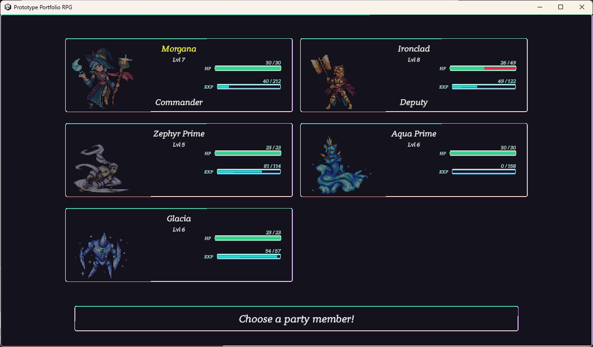

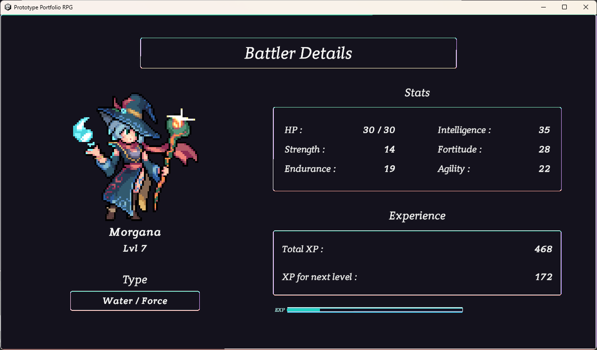

#### **Inventory and Items**

Throughout the game, you can acquire various items, such as healing potions or status cures. The Inventory system organizes these items by category (for example: recovery items, key items, etc.) and displays the player’s current amount of in-game currency (GP). The inventory menu allows using usable items directly (for instance, using a potion to heal a battler) or simply checking item descriptions. Items can be obtained from NPCs, chests, or as loot from battle. There is an economy in the game: merchants in the world (like the shop in the demo) will sell items in exchange for GP, and the player can also sell unwanted items to merchants to gain GP. This shop system features a straightforward buy/sell menu interface with prices and quantities, much like classic JRPG shops.

#### **Barracks Organization**

In addition to the active party, the game provides a storage system called the Barracks for extra battlers that are not currently in the player's party. The Barracks interface is essentially a storage box where additional recruited battlers can be deposited when you exceed the party limit. The barracks is divided into multiple depots to help organize stored battlers. You can swap battlers between your active party and the barracks depots as needed, with the restriction that the Commander must always stay in the active party (the Commander cannot be stored away, since they represent the player character). The barracks system allows players to collect more than six battlers over time and experiment with different team compositions by rotating members in and out. In the current prototype, accessing the barracks is done via the in-game menu; a future improvement on the roadmap is to integrate this into an in-world location for more immersive access.

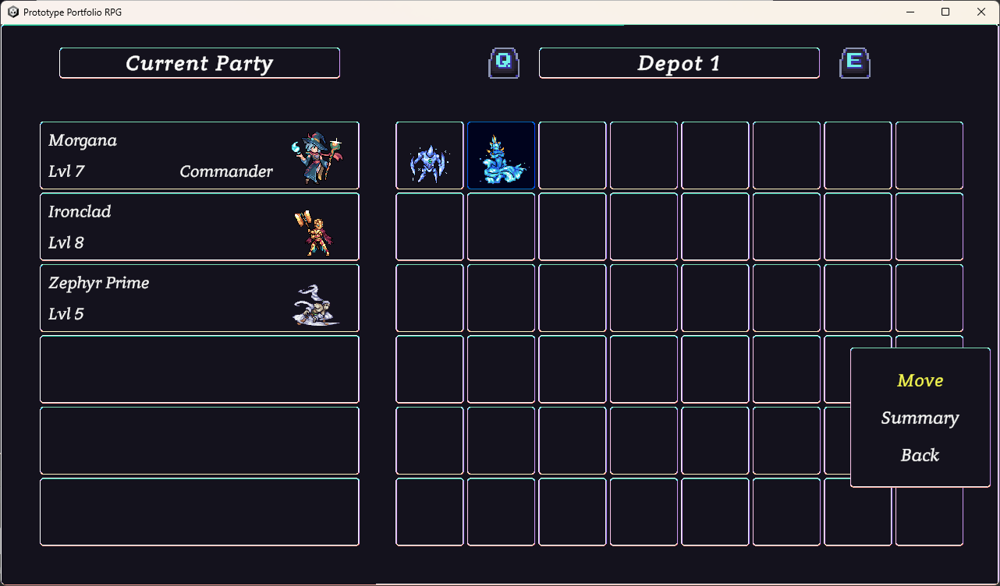

#### **Turn-Based Combat System**

Combat in this game consists of classic turn-based battles between two sides (the player’s party vs. enemy battlers). Encounters can occur either by talking to a rival Commander or by running into rogue battlers in the overworld. Battles take place on a separate battle screen with the player's active battlers on one side and enemies on the other, each taking turns according to their speed stat and action priority. During a battle, the player can choose from several actions each turn for the currently active battler. The available combat actions include: Fight, Talk, Item, Guard, Switch, and Run.
  - *Fight*: Perform an offensive move or attack. Each battler has a set of moves that cost SP to use. If a battler runs out of SP for all moves, they can still perform a basic struggle attack as a fallback. Moves can have different elemental types and effects (damage, status ailments, etc.).
  - *Talk*: Attempt to recruit the opponent to join your team via negotiation. This action is only available to the Commander and only in battles against rogue battlers. Choosing Talk will initiate a dialogue with the enemy. If successful, the enemy battler will be persuaded to join your party (ending the battle if it was the last/only enemy). The chance of success depends on various factors (the enemy’s remaining health, their status ailments, etc.).
  - *Item*: Open the inventory in battle to use a consumable item. This includes using healing potions, antidotes for status conditions, etc., on your own battlers. Using an item consumes the player’s turn for that battler.
  - *Guard*: Take a defensive stance for the round, which reduces incoming damage until the next turn. Guarding can be a strategic move to protect a weak or injured battler from a heavy attack.
  - *Switch*: Swap the current active battler with another member of the party. This allows you to change which battler is on the front lines. Switching does use up the turn. It’s useful for bringing in a battler with a type advantage, or to withdraw a battler who is low on HP.
  - *Run*: Attempt to flee from the battle, ending the encounter. Running is not guaranteed to succeed against all enemies; and importantly, you cannot run from Commander battles.

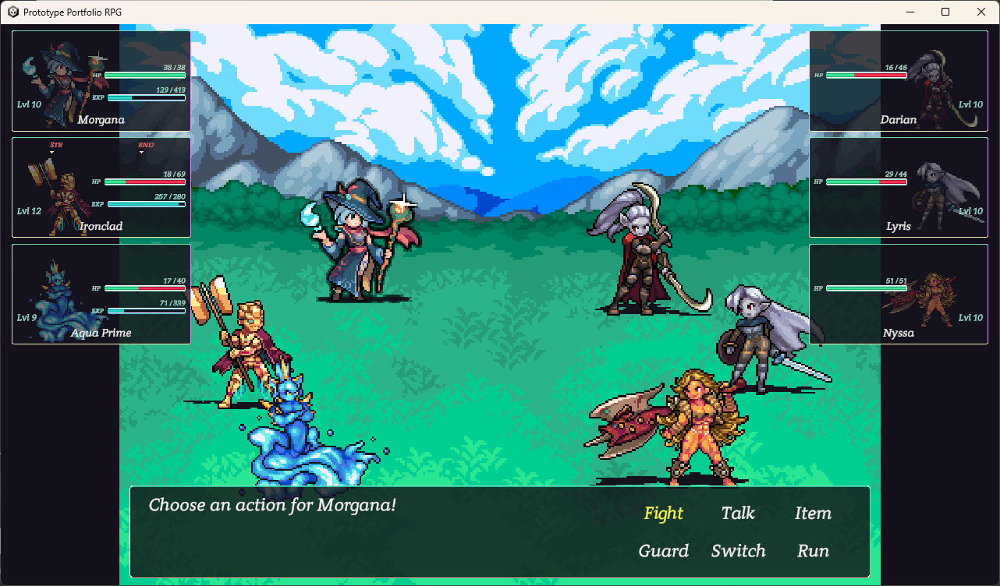

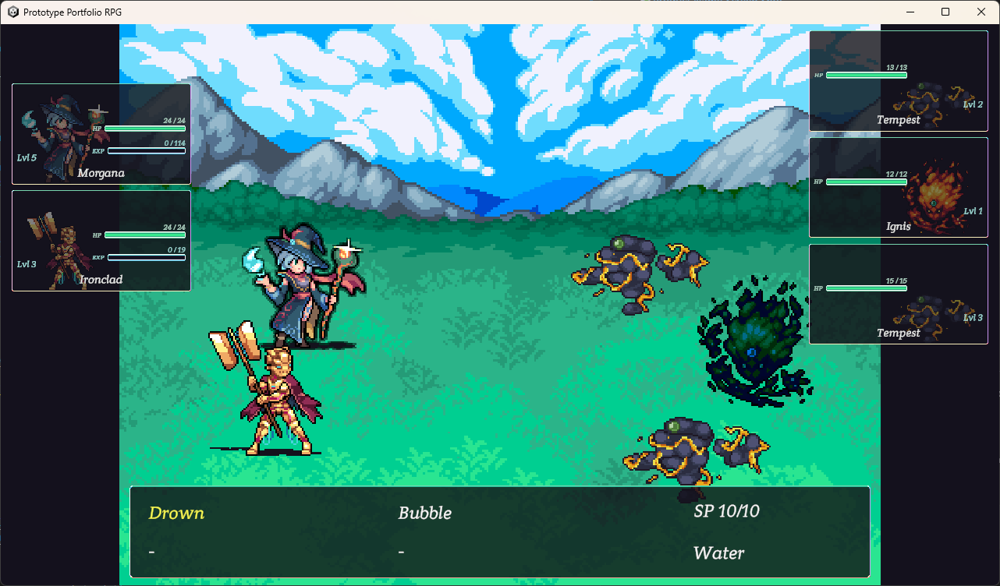
  

#### **Recruitment and Battle Types**

There are two types of battle scenarios in the game, each with slightly different rules: Commander Battles (battles against other named NPC Commanders) and Rogue Battles (battles against battlers encountered in the field). In Commander Battles, the player is not allowed to recruit the opponent’s battlers. Additionally, fleeing from a Commander battle is not permitted, so the only way out is to win or be defeated. In Rogue Battles, however, the Commander’s unique Talk action comes into play, giving an opportunity to recruit the opponent if conditions are favorable. Fleeing is also allowed in rogue battles if the player decides not to engage. Successfully talking to and recruiting a battler will add them to your party (or send them to the barracks if your party is full). If an enemy is defeated in combat, they may drop loot and the player's active battlers will gain XP. Enemy AI in the current prototype is relatively simple (enemies choose moves semi-randomly), but the framework is in place to make AI more advanced in the future.
  
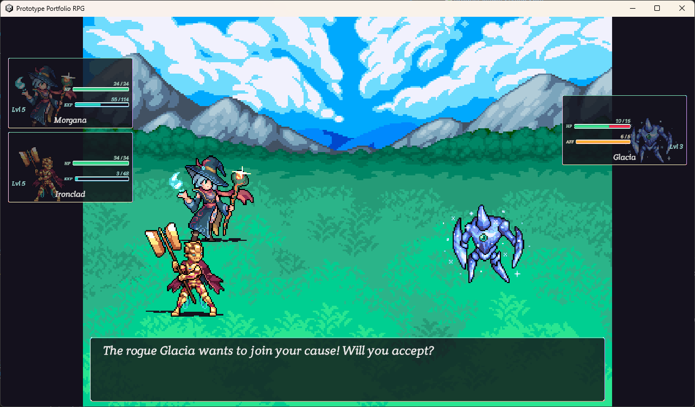

#### **Experience and Progression**

As enemies are defeated, your battlers will gain XP. When enough XP is accumulated, a battler will level up, improving its stats. Leveling up may also unlock new moves for that battler to use in combat. Certain battlers can also transform into stronger forms upon reaching specific level thresholds. All progression (levels, learned moves, etc.) is saved as part of your game data, so your leveled-up team will persist when loading a save.

(<a href="#readme-top">back to top</a>)

## Controls

The prototype uses keyboard controls typical of a retro RPG:

- **Arrow Keys (Up, Down, Left, Right**:
  Move the player character around the world map, and navigate menu interfaces.

- **Z**:
  Interact/Confirm – Used to talk to NPCs, examine objects, confirm menu selections, and also to speed up text scrolling during dialogue.

- **X**:
  Cancel/Back – Used to cancel or go back in menus, close open windows, and also provides a quick way to choose “No” in dialogues. (Like Z, pressing X can also speed up message text).

- **Enter**:
  Open the in-game menu while exploring. Press Enter again to close the menu. This menu gives access to party, inventory, save, etc. during exploration.

- **Q / E**:
  Switch pages in the Barracks storage interface. When viewing the Barracks, Q and E will cycle through the different depot boxes to show stored battlers.

*Note:* This prototype does not currently support gamepad or remappable keys – the controls are fixed as listed above. The keys were chosen to mimic classic Game Boy RPG controls (Z/X acting as A/B buttons, Enter as Start). Both the overworld and menus use the same keys for consistency. In combat, the arrow keys move the selection cursor between actions or targets, Z selects an action, and X cancels or opens the previous menu (for example, to back out from choosing an item or move).

(<a href="#readme-top">back to top</a>)

## How to Play

A pre-built executable of the game is available for Windows on the project’s [itch.io](https://leminiscent.itch.io/prototype-portfolio-rpg) page. To play the game, simply download the release ZIP file and unzip it, then run the Prototype Portfolio RPG.exe file to launch the game. No installation is required beyond this – the game will start and you can begin playing from the main menu.

(<a href="#readme-top">back to top</a>)

## Roadmap

- [ ] Transfer barracks functionality from the menu to a dedicated in-world facility
- [ ] Incorporate commander and deputy-specific abilities
- [ ] Add a crafting system using loot from battles
- [ ] Improve sorting features for both barracks and inventory
- [ ] Enhance dialogue visuals with camera adjustments, overhead icons, and portraits
- [ ] Expand recruitment interactions with more dialogue and scenario elements
- [ ] Introduce enemy AI that factors in current battle conditions and individual personality
- [ ] Grow the world map with new locations and interactive features

(<a href="#readme-top">back to top</a>)

## Contact

Email: [nogueiralemuel@gmail.com](mailto:nogueiralemuel@gmail.com)  
LinkedIn: [https://www.linkedin.com/in/lemuel-nogueira/](https://www.linkedin.com/in/lemuel-nogueira/)

(<a href="#readme-top">back to top</a>)

